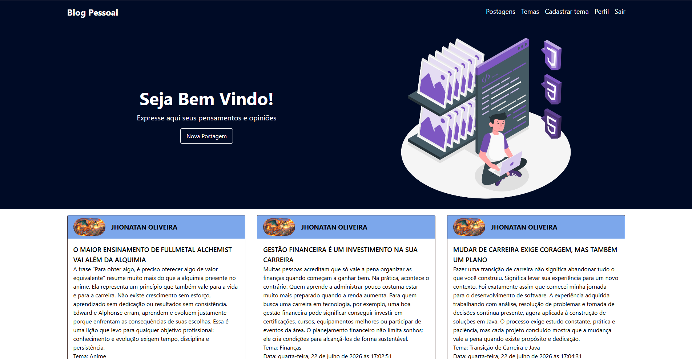
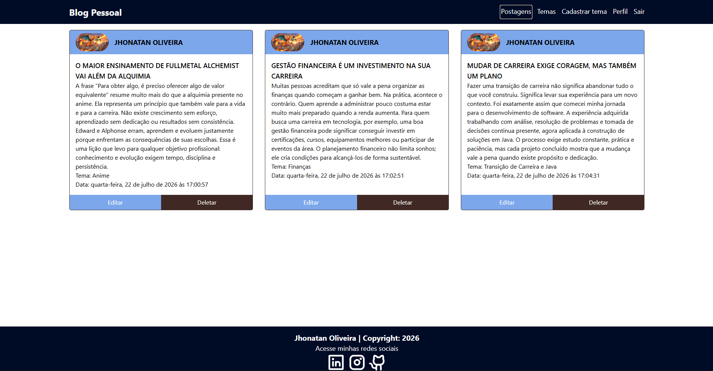
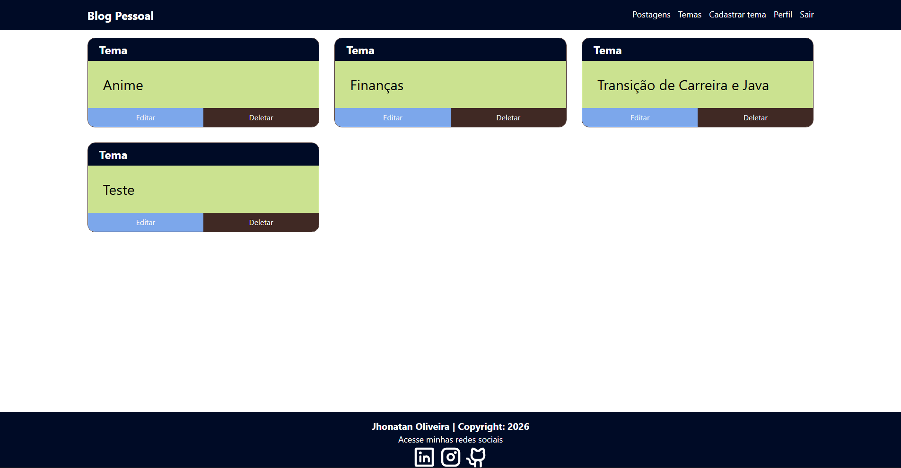
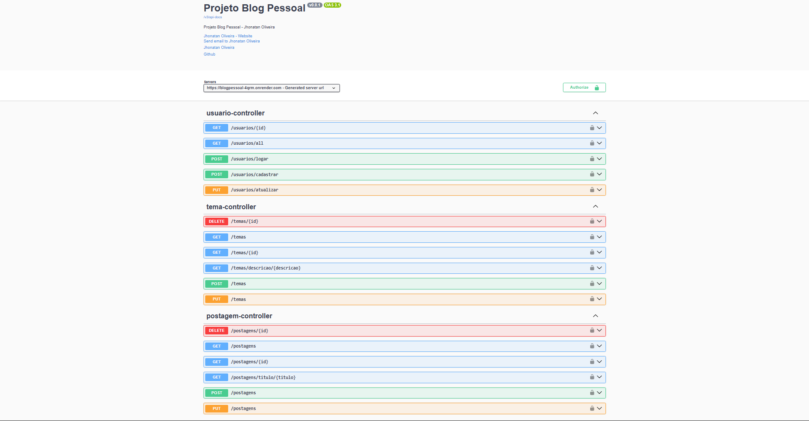
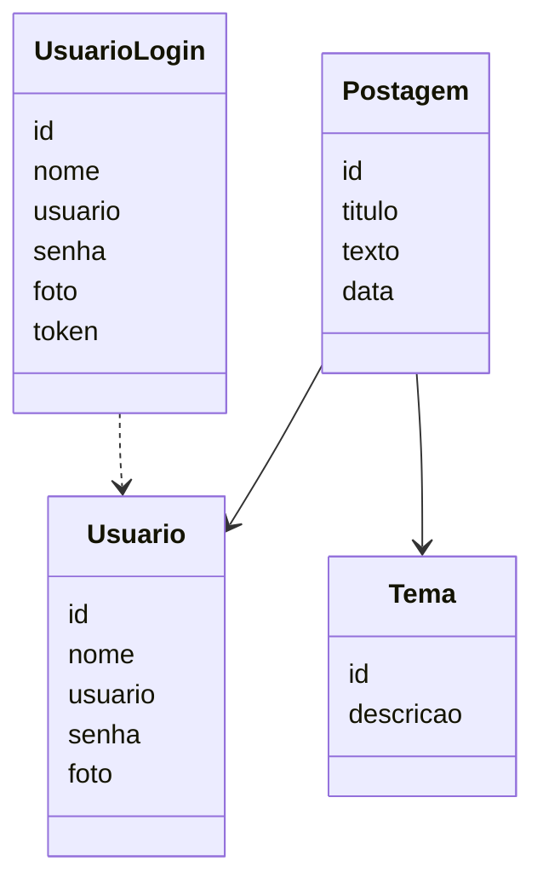
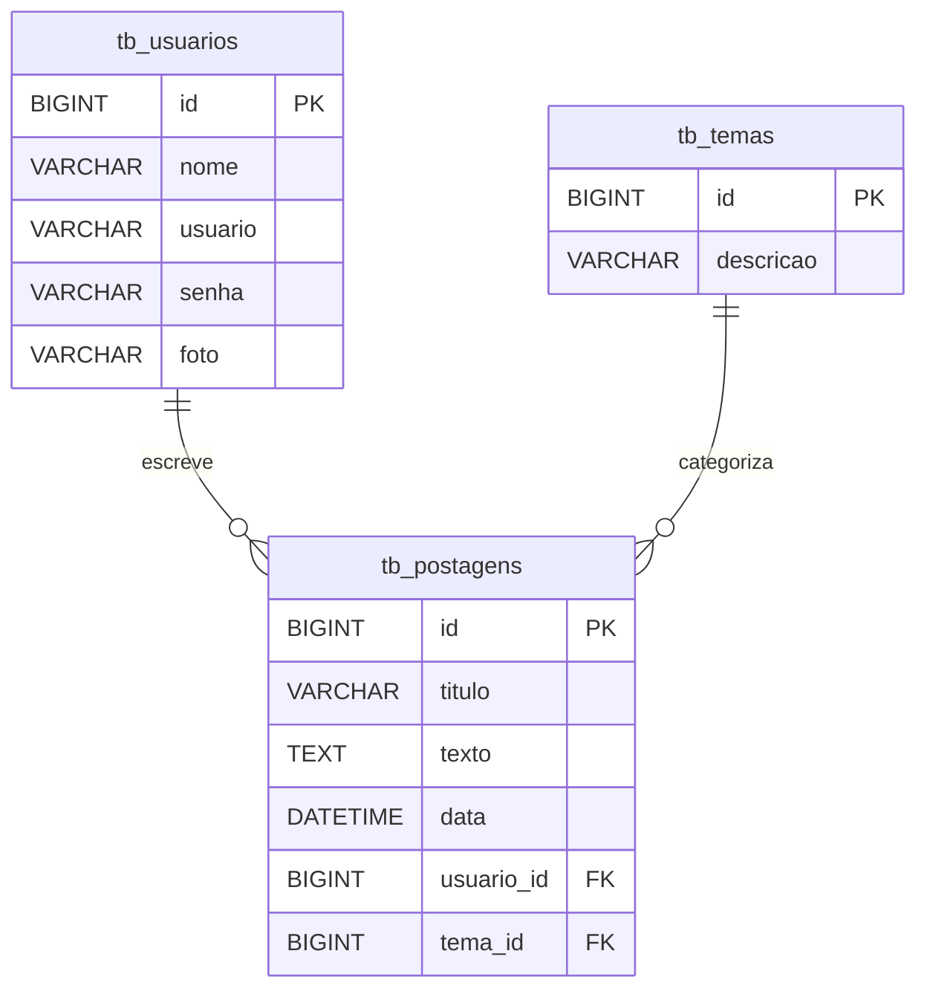

# 📝 Blog Pessoal 

---

## 📖 Sobre o Projeto

O **Blog Pessoal** é uma aplicação **Full Stack** desenvolvida durante o **Bootcamp Java Full Stack da Generation Brasil**.

O projeto é composto por uma **API REST** desenvolvida em **Java com Spring Boot** e um **Frontend em React**, permitindo que usuários realizem cadastro, autenticação e gerenciamento de postagens e temas de forma segura.

Durante o desenvolvimento foram aplicados diversos conceitos utilizados no mercado, como arquitetura em camadas, autenticação JWT, persistência de dados, validações, tratamento de exceções e deploy em produção.

---

# 🚀 Demonstração

### 🌐 Frontend

https://blog-pessoal-react-woad.vercel.app

### 📚 Documentação da API (Swagger)

https://blogpessoal-4qrm.onrender.com/swagger-ui/index.html

### 💻 Repositório Frontend

https://github.com/JhonatanOliveira18/blog-pessoal-react

---

# 📸 Screenshots

## 🔐 Tela de Login

> Página inicial da aplicação, onde o usuário realiza a autenticação utilizando e-mail e senha.

<p align="center">
  
</p>

---

## 🏠 Página Inicial

> Tela principal da aplicação após o login.

<p align="center">
  
</p>

---

## 📝 Gerenciamento de Postagens

> Tela responsável pelo cadastro, edição, listagem e exclusão das postagens.

<p align="center">
  
</p>

---

## 🏷️ Gerenciamento de Temas

> Cadastro e gerenciamento dos temas utilizados para categorizar as postagens.

<p align="center">
  
</p>

---

## 📚 Documentação da API (Swagger)

> Documentação interativa da API, permitindo testar todos os endpoints diretamente pelo navegador.

<p align="center">
  
</p>

---

# 🎯 Objetivos do Projeto

Este projeto teve como objetivo colocar em prática conceitos como:

- Desenvolvimento de APIs REST
- Spring Boot
- Spring Security
- JWT
- Spring Data JPA
- Hibernate
- Relacionamentos entre entidades
- Arquitetura em camadas
- MySQL
- Docker
- Deploy
- Integração Frontend + Backend

---

# ✨ Funcionalidades

## 👤 Usuários

- Cadastro de usuário
- Login com JWT
- Atualização de usuário
- Listagem de usuários

---

## 📝 Postagens

- Criar postagem
- Listar postagens
- Buscar postagem por ID
- Atualizar postagem
- Excluir postagem

---

## 🏷️ Temas

- Criar tema
- Listar temas
- Buscar tema por ID
- Atualizar tema
- Excluir tema

---

# 🛠 Tecnologias Utilizadas

## Backend

- Java 21
- Spring Boot
- Spring Web
- Spring Security
- Spring Data JPA
- Hibernate
- JWT
- Maven

## Banco de Dados

- MySQL

## Frontend

- React
- TypeScript
- Tailwind CSS

## Ferramentas

- Docker
- Swagger
- Insomnia
- Git
- GitHub
- STS

## Deploy

- Render
- Vercel

---

# 🏛 Arquitetura

O projeto segue a arquitetura em camadas recomendada pelo ecossistema Spring.

```text
Controller
      │
      ▼
Service
      │
      ▼
Repository
      │
      ▼
MySQL
```

Estrutura do projeto:

```text
src
├── configuration
├── controller
├── dto
├── model
├── repository
├── security
├── service
└── BlogPessoalApplication
```

---

# 🔐 Fluxo de Autenticação JWT

```text
Usuário faz Login
        │
        ▼
Spring Security
        │
        ▼
JWT é gerado
        │
        ▼
Frontend salva o Token
        │
        ▼
Requisições enviam:

Authorization:
Bearer TOKEN

        │
        ▼
JWT Filter
        │
        ▼
Controller
```

---

# 📊 Modelo de Dados

## Diagrama de Classes



---

## Diagrama Relacional



---

# 📡 Endpoints

## Usuários

| Método | Endpoint |
|---------|----------|
| POST | /usuarios/cadastrar |
| POST | /usuarios/logar |
| GET | /usuarios/all |
| GET | /usuarios/{id} |
| PUT | /usuarios/atualizar |

---

## Postagens

| Método | Endpoint |
|---------|----------|
| GET | /postagens |
| GET | /postagens/{id} |
| POST | /postagens |
| PUT | /postagens |
| DELETE | /postagens/{id} |

---

## Temas

| Método | Endpoint |
|---------|----------|
| GET | /temas |
| GET | /temas/{id} |
| POST | /temas |
| PUT | /temas |
| DELETE | /temas/{id} |

---

# ⚙️ Como Executar o Projeto

## Clone o repositório

```bash
git clone https://github.com/JhonatanOliveira18/blog-pessoal.git
```

Entre na pasta

```bash
cd blog-pessoal
```

---

## Configure o banco

```properties
spring.datasource.url=jdbc:mysql://localhost:3306/db_blogpessoal
spring.datasource.username=seu_usuario
spring.datasource.password=sua_senha

spring.jpa.hibernate.ddl-auto=update
spring.jpa.show-sql=true
```

---

## Execute a aplicação

Pela IDE ou utilizando o Maven:

```bash
mvn spring-boot:run
```

A aplicação estará disponível em:

```
http://localhost:8080
```

---

## Executando com Docker

```bash
docker build -t blog-pessoal .
```

```bash
docker run -p 8080:8080 blog-pessoal
```

---

# 🧪 Testando a API

1. Cadastre um usuário.
2. Faça login.
3. Copie o JWT retornado.
4. Abra o Swagger.
5. Clique em **Authorize**.
6. Informe:

```
Bearer seu_token
```

Agora todos os endpoints protegidos estarão disponíveis para teste.

---

# 🚀 Roadmap

- ✅ CRUD completo
- ✅ Spring Security
- ✅ JWT
- ✅ Swagger
- ✅ Docker
- ✅ Deploy
- ⏳ Testes Unitários
- ⏳ GitHub Actions (CI/CD)

---

# 🤝 Contribuição

Contribuições são sempre bem-vindas!

Caso tenha alguma sugestão ou melhoria:

- Faça um Fork
- Crie uma Branch
- Abra um Pull Request

---

# 👨‍💻 Desenvolvedor

**Jhonatan Oliveira**

Java Backend Developer

